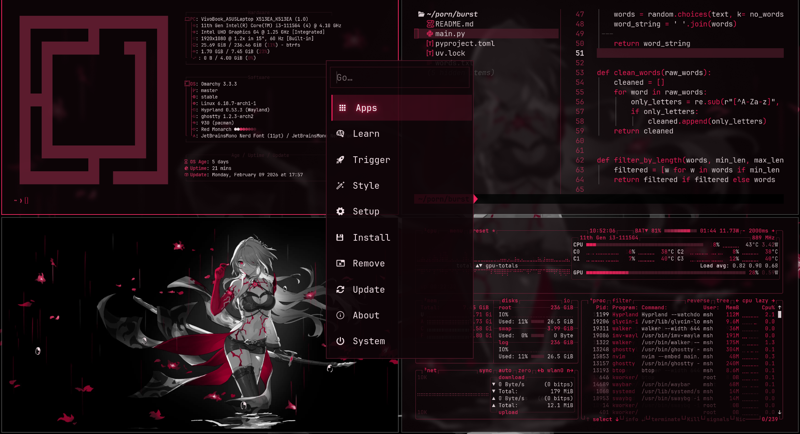

# Red Monarch Theme

## Preview



A rose-black Omarchy theme built around `#191414`, blush text, and a vivid rose primary.

## Installation

1. Place this directory in `~/.config/omarchy/themes/`
2. Configure your Omarchy settings to use `red-monarch`

## Features

- **Background**: `#191414`
- **Foreground**: `#FFEAF2`
- **Primary**: `#F1396D`
- **Customizable**: Modify colors in `colors.toml` and the app-specific theme files

## Files

- `colors.toml` - Shared Omarchy palette
- `alacritty.toml`, `kitty.conf`, `ghostty.conf` - Terminal palettes
- `waybar.css`, `walker.css`, `mako.ini`, `swayosd.css`, `hyprland.conf`, `hyprlock.conf` - Desktop shell styling
- `btop.theme`, `eza.yml` - CLI helper themes

## Usage

Set in your Omarchy config:

```json
{
  "theme": "red-monarch"
}
```

nvim theme: [monarch.nvim](https://github.com/kamatealif/monarch.nvim.git)
